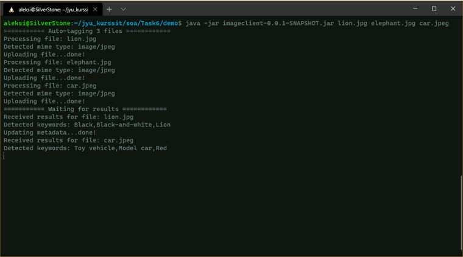
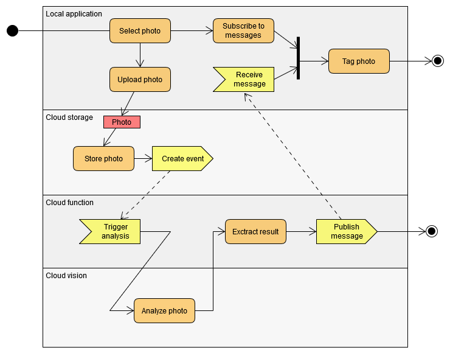

# ImageTagger

A practice project created for Jyväskylä University course "SOA and cloud computing"

ImageTagger is a CLI application that uses Google cloud vision to automatically tag locally saved photos based on their content.

### Main features:

- Supports XMP tags
- Supports batch processing multiple files
- Uses an asynchronous dataflow for better performance

### Usage:

### Data flow:

- The local application uploads each photograph to Google Cloud Storage
- Creating the file triggers a Cloud Function that calls the Cloud Vision API to analyse the uploaded photo
- The Cloud Function publishes the results to a Pub/Sub topic that the local application is subscribed to
- When the local application receives the results, it modifies the photographs metadata and adds the generated keywords

## NOTE!

The cloud function is no longer deployed and the repository does not include authorization details that are necessary to run the application.

Also, this is only a proof-of-concept that currently overwrites all previous XMP & IPTC metadata from photos! To prevent overwriting critical data, the application creates a copy of each tagged photo.
